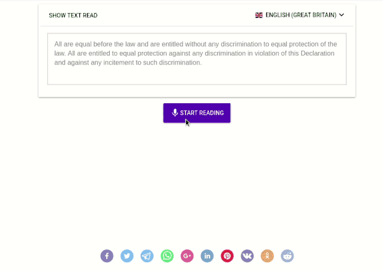

[](https://travis-ci.org/GoodSpeech/good-speech-web-client)
[](https://codecov.io/gh/GoodSpeech/good-speech-web-client)
[](https://opensource.org/licenses/MIT)

# Good Speech

Practice your speech level in any language

Live example: [www.good-speech.com](https://www.good-speech.com)




### About

Good speech gives you an estimation of your pronunciation level in most of the languages supported by google's
API speech recognition integrated in Chrome browser.

This project was born as an idea to reuse some of the javascript libraries published by
@sljavi after his thesis [Hands Free For Web](https://www.handsfreeforweb.com/en/),
an accessibility tool which allows to browse the web using only your voice. Please check the project.

### Installation

```
git clone git@github.com:GoodSpeech/good-speech-web-client.git
cd good-speech-web-client
yarn
```

### Serve the app locally

```
yarn start
```

### Tests

#### Run tests
```
yarn test
```

#### Debug tests

```
yarn debug
```

#### Run tests with coverage

```
yarn coverage
```

### App commands


| Command | Description |
| --- | --- |
| `yarn generate:translation` | Translations for the web application in every available language |
| `yarn generate:content` | Random content used as text to read by the user. Currently based in the Universal Declaration of Human Rights |
